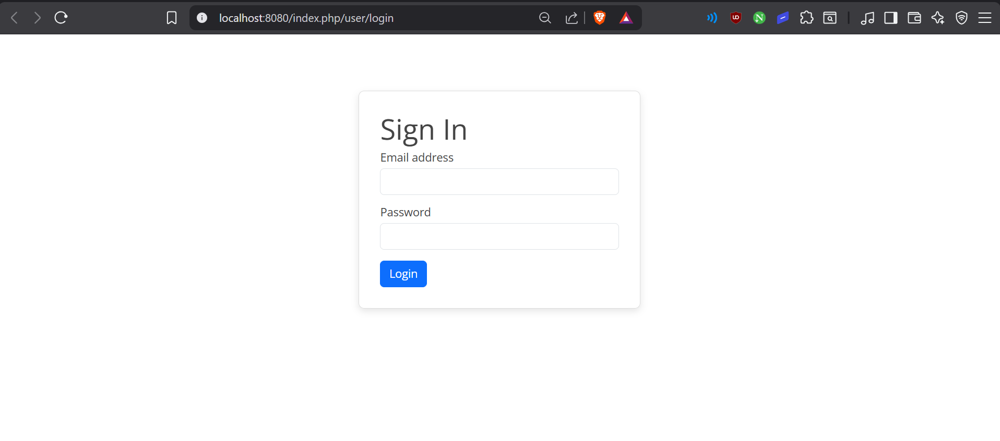

# Praktikum 3: Modul Login (CodeIgniter 4)

## Nama: Syafarudiansya
## NIM: 312410381
## Kelas: I241A

---

## Tujuan

* Memahami konsep **Authentication (Auth)** dan **Filter**
* Membuat sistem login sederhana
* Mengelola session pada CodeIgniter 4
* Mengamankan halaman dengan filter

---

## Cara menjalankan project

### 1. Setup Database

Buat database lalu jalankan query berikut:

```sql
CREATE TABLE user (
  id INT(11) auto_increment,
  username VARCHAR(200) NOT NULL,
  useremail VARCHAR(200),
  userpassword VARCHAR(200),
  PRIMARY KEY(id)
);
```

### 2. Membuat Model User

```php
<?php

namespace App\Models;

use CodeIgniter\Model;

class UserModel extends Model
{
    protected $table = 'user';
    protected $primaryKey = 'id';
    
    protected $useAutoIncrement = true;
    protected $allowedFields = ['username', 'useremail', 'userpassword'];
}
```

---

### 3. Membuat Controller User

```php
<?php

namespace App\Controllers;

use App\Models\UserModel;

class User extends BaseController
{
    public function index()
    {
        $title = 'Daftar User';
        $model = new UserModel();
        $users = $model->findAll();
        return view('user/index', compact('users', 'title'));
    }

    public function login()
    {
        helper(['form']);
        $email = $this->request->getPost('email');
        $password = $this->request->getPost('password');

        if (!$email) 
        {
            return view('user/login');
        }

        $session = session();
        $model = new UserModel();
        $login = $model->where('useremail', $email)->first();

        if ($login) 
        {
            $pass = $login['userpassword'];
            if (password_verify($password, $pass)) 
            {
                $login_data = [
                    'user_id'    => $login['id'],
                    'user_name'  => $login['username'],
                    'user_email' => $login['useremail'],
                    'logged_in'  => TRUE,
                ];
                $session->set($login_data);
                return redirect()->to('/admin/artikel');
            } 
            else 
            {
                $session->setFlashdata("flash_msg", "Password salah.");
                return redirect()->to('/user/login');
            }
        } 
        else 
        {
            $session->setFlashdata("flash_msg", "Email tidak terdaftar.");
            return redirect()->to('/user/login');
        }
    }

    // Tambahkan Fungsi Logout ini (Sesuai Gambar 13.5 di Modul)
    public function logout()
    {
        session()->destroy();
        return redirect()->to('/user/login');
    }
}
```

---

### 4. Membuat View Login

```php
<!DOCTYPE html>
<html lang="en">
<head>
    <meta charset="UTF-8">
    <title>Login</title>
    <link href="https://cdn.jsdelivr.net/npm/bootstrap@5.3.0/dist/css/bootstrap.min.css" rel="stylesheet">
    
    <link rel="stylesheet" href="<?= base_url('/style.css'); ?>">

    <style>
        /* Tambahkan ini sedikit agar form login berada di tengah kotak */
        #login-wrapper {
            max-width: 400px;
            margin: 80px auto;
            padding: 30px;
            border: 1px solid #ddd;
            border-radius: 8px;
            box-shadow: 0 4px 10px rgba(0,0,0,0.1);
        }
    </style>
</head>
<body>
    <div id="login-wrapper">
        <h1>Sign In</h1>
        
        <?php if(session()->getFlashdata('flash_msg')): ?>
            <div class="alert alert-danger">
                <?= session()->getFlashdata('flash_msg') ?>
            </div>
        <?php endif; ?>

        <form action="" method="post">
            <div class="mb-3">
                <label for="InputForEmail" class="form-label">Email address</label>
                <input type="email" name="email" class="form-control" id="InputForEmail" value="<?= set_value('email') ?>">
            </div>
            
            <div class="mb-3">
                <label for="InputForPassword" class="form-label">Password</label>
                <input type="password" name="password" class="form-control" id="InputForPassword">
            </div>
            
            <button type="submit" class="btn btn-primary">Login</button>
        </form>
    </div>
</body>
</html>
```


## 5. Membuat Data Seeder (Data Dummy)

Buat seeder:

```bash
php spark make:seeder UserSeeder
```

Isi file:

```php
<?php

namespace App\Database\Seeds;

use CodeIgniter\Database\Seeder;

class UserSeeder extends Seeder
{
    public function run()
    {
        $model = model('UserModel');
        $model->insert([
            'username'     => 'admin',
            'useremail'    => 'admin@email.com',
            'userpassword' => password_hash('admin123', PASSWORD_DEFAULT),
        ]);
    }
}
```

Jalankan:

```bash
php spark db:seed UserSeeder
```

---

### 6 Uji coba Logi

* Halaman Login



---

### 7. Menambahkan Auth Filter

#### Buat file baru "Auth.php" di "app\Filters"

```php
<?php 

namespace App\Filters;

use CodeIgniter\HTTP\RequestInterface;
use CodeIgniter\HTTP\ResponseInterface;
use CodeIgniter\Filters\FilterInterface;

class Auth implements FilterInterface
{
    public function before(RequestInterface $request, $arguments = null)
    {
        // jika user belum login
        if(! session()->get('logged_in')){
            // maka redirect ke halaman login
            return redirect()->to('/user/login');
        }
    }

    public function after(RequestInterface $request, ResponseInterface $response, $arguments = null)
    {
        // Do something here
    }
}
```

#### Buka file "app/Config/Filters.php" dan tambahkah kode berikut:

```php
'auth'          => \App\Filters\Auth::class
```

```php
    public array $aliases = [
        'csrf'          => CSRF::class,
        'toolbar'       => DebugToolbar::class,
        'honeypot'      => Honeypot::class,
        'invalidchars'  => InvalidChars::class,
        'secureheaders' => SecureHeaders::class,
        'cors'          => Cors::class,
        'forcehttps'    => ForceHTTPS::class,
        'pagecache'     => PageCache::class,
        'performance'   => PerformanceMetrics::class,
        'auth'          => \App\Filters\Auth::class
    ];

```
#### Buka file "app/Config/Routes.php" dan sesuaikan kodenya.

```php
$routes->group('admin', ['filter' => 'auth'], function($routes) {
    $routes->get('artikel', 'Artikel::admin_index');
$routes->add('artikel/add', 'Artikel::add');
$routes->add('artikel/edit/(:any)', 'Artikel::edit/$1');
$routes->get('artikel/delete/(:any)', 'Artikel::delete/$1');
});

$routes->get('user/login', 'User::login');
$routes->post('user/login', 'User::login');
```

---

### 8. Percobaan Akses Menu Admin


---

### 9. Fungsi Logout
Tambahkan method logout pada Controller User seperti berikut:

```php
public function logout()
{
    session()->destroy();
    return redirect()->to('/user/login');
}
```
